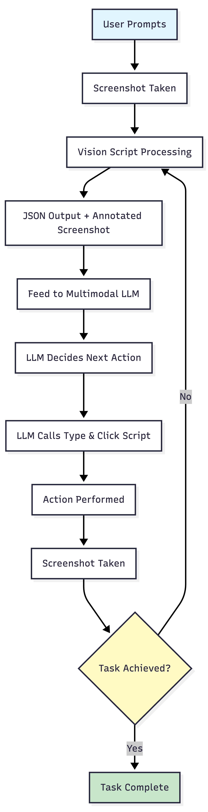
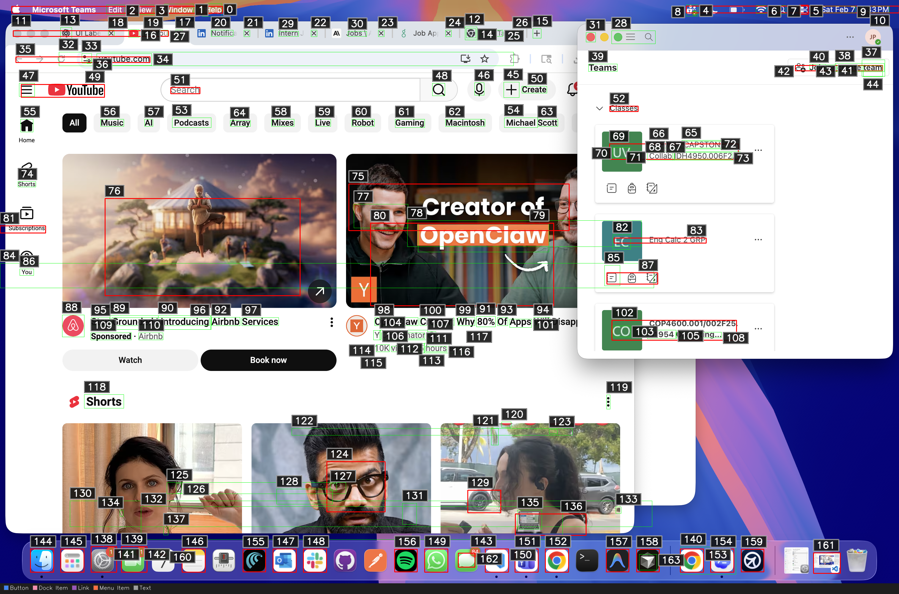

# Nav 

An open-source desktop agent that can see your screen, reason about what’s on it, and perform real actions on macOS.


- **See**: the agent captures the screen and finds clickable UI elements.
- **Understand**: a vision-language model reasons over the annotated screenshot and chooses the next action.
- **Interact**: the action layer executes clicks and keystrokes on the real desktop.

Click **Get Started** to go to the main workspace.

### 2. Main workspace


Layout:

| Region | Purpose |
|--------|---------|
| **Title bar** | Centered “Nav” branding; hamburger toggle for the sidebar; macOS traffic-light safe area. |
| **Left sidebar** (resizable 240–420px, collapsible) | **New Chat** button; searchable conversation list; per-conversation delete; storage paths (conversations `.txt`, screenshots) with “Open folder” links; **Settings** at footer. The sidebar can be collapsed to icon-only for maximum screen real estate. |
| **Header** | Active conversation title; **Running** / **Idle** status; vision mode badge (e.g. Fallback IDs, Raw Screenshot); **Stop** button when the agent is active. |
| **Message thread** | User and assistant bubbles; streaming text; inline **ActivityTrace** with expandable step cards, thumbnails, and timestamps for each agent action. |
| **Composer** | Model selector dropdown (Claude, GPT, Gemini, GLM); text input; **Send** / **Stop** button. Model can be switched without opening Settings. |

Banners show WebSocket status and API key status. If the server is down or a key is missing, you'll see it there.

### 3. ActivityTrace

Each assistant response can include an **ActivityTrace**: a collapsible list of steps the agent performed. Each step shows a title, optional caption, and thumbnail grid of screenshots taken at that moment. Clicking a thumbnail opens the full **ImageViewer** for inspection. This is how you verify that the agent saw the right UI and took the intended action—no black box.


## How it works

The core loop: **perceive → reason → act → perceive again**. The flowchart below shows the full cycle. Images are in `readme/` and `mac_ui_outputs/`.

### The flowchart — step by step



| Step | What happens |
|------|--------------|
| **1. User prompt** | The user types a goal (e.g. "Open Notes and create a new note") into the Nav composer. The goal is sent over WebSocket to the Python backend. |
| **2. Screenshot** | `agent.py` captures the current screen with `pyautogui.screenshot()`. The image is saved to disk (e.g. `screenshots/screenshot_20240207_101230.png`). |
| **3. Vision processing** | `vision.py` analyzes the screenshot. In auto mode it uses a VLM first, then falls back to classical CV if needed. It detects buttons, links, inputs, menus, and other interactive elements. |
| **4. JSON + annotated screenshot** | The vision pipeline outputs two artifacts: a structured JSON of element boxes (id, type, label, bounding box, click coordinates), and an annotated image with numbered IDs overlaid so the LLM can refer to elements by ID. |
| **5. Feed to multimodal LLM** | The agent builds a prompt containing the user goal, the annotated screenshot, and the box metadata. The LLM sees both the pixels and the structured list—no coordinate guessing. |
| **6. LLM decides next action** | The model outputs a JSON action: `{ "action": "click", "element_id": 42 }` or `{ "action": "type", "text": "Hello" }`. It chooses based on what it sees and the task. |
| **7. Type & Click script** | `typeandclick.py` maps element IDs to screen coordinates, applies scale factors for Retina displays, and prepares the concrete mouse/keyboard commands. |
| **8. Action performed** | PyAutoGUI executes the click or keystroke on the real desktop. The user sees the action happen. |
| **9. Screenshot again** | Another screenshot is taken to capture the result. The loop repeats. |
| **10. Task achieved?** | The agent (and optionally the model) evaluates whether the goal is done. If not, it loops back to step 3. If yes, it returns a summary to the UI and stops. |

The React UI streams this loop in real time: each step, screenshot, and action appears in the ActivityTrace so you can see exactly what the agent did.

### The vision output — what the model sees

The annotated screenshots are what the LLM receives. Each interactive element gets a bounding box and an ID. The model says "click element 12" instead of "click at (1082, 932)"—which is more reliable across resolutions and layouts.

<table>
	<tr>
		<td>
			
		</td>
		<td>
			
		</td>
	</tr>
	<tr>
		<td colspan="2" style="padding-top: 8px; font-size: 13px; color: #666;">
			<strong>What you're seeing:</strong> The raw screenshot with bounding boxes and IDs overlaid. Each box corresponds to a detected UI element. The companion JSON files (<code>test2_ui_everything.json</code>, <code>test_ui_everything.json</code>) contain the exact coordinates and labels.
		</td>
	</tr>
</table>

### The box schema — structured UI representation

The vision pipeline emits a JSON structure like this. The LLM uses it to resolve element IDs to coordinates; the agent uses it to execute clicks.

```json
{
	"screenshot": "screenshot_20240207_101230.png",
	"boxes": [
		{
			"id": 12,
			"type": "button",
			"label": "Send",
			"x1": 1042,
			"y1": 912,
			"x2": 1118,
			"y2": 952,
			"click_x": 1082,
			"click_y": 932
		}
	],
	"...": "more fields"
}
```

- **id** — Unique identifier the model references in its action (e.g. `"element_id": 12`).
- **type** — Semantic role: `button`, `link`, `textfield`, `checkbox`, `menuitem`, etc.
- **label** — Visible or accessible text when available.
- **x1, y1, x2, y2** — Bounding box in screenshot coordinates.
- **click_x, click_y** — Preferred click point (often the center; adjusted for small targets).

### Implementation notes

- **UI ↔ backend:** The React app connects to `ws://127.0.0.1:8765`. The Python `agent_server.py` orchestrates runs and streams status, text deltas, and screenshot paths back to the UI.
- **agent.py:** Owns the main loop. Each iteration: screenshot → vision (if needed) → prompt build → LLM call → parse action → typeandclick → repeat.
- **vision.py:** VLM-first with CV fallback. Outputs annotated image + JSON. Supports Florence-2 and other backends via env vars.
- **typeandclick.py:** Wraps pyautogui for click, type, scroll, hotkey. Handles coordinate scaling and safe failure when the display is unavailable.

---

## What this project is

- A desktop app with a chat UI for the screen-reading agent
- A Python agent that sees the screen and decides what to do
- A vision pipeline that finds clickable UI elements
- A real action layer that clicks and types on macOS

## What it is not

- A production ready automation system
- A guaranteed reliable agent
- A full OS replacement

## Project structure

The app uses both the desktop folder and the v1 root folder.

| Location | Role |
| --- | --- |
| desktop/ | Electron app with the React UI, preload, and main process. This is the app you run. |
| v1 root | Python backend. The Electron app starts agent_server.py, which uses agent.py, vision.py, and typeandclick.py. |

When you launch the app, Electron starts the Python server using the v1 root path. If the Python files are missing, the UI will not work.

## Why this exists

I am trying to do a small and honest version of computer use automation. A lot of research projects look impressive, but they are often tuned for benchmarks. Here I just want something that works on my laptop, even if it is messy.

## How this compares to OSWorld and UI-TARS

This is the part where I try to be real about scope.

- OSWorld is a benchmark suite. It measures how well agents complete tasks on a fixed set of apps and goals. It is good for research comparison but it is not focused on your actual laptop setup.
- UI-TARS focuses on dataset driven UI reasoning and structured actions. It is more about training and evaluation of UI actions than building a simple local tool.

This project is smaller. It is more like a personal lab tool. The point is not to win a benchmark. The point is to automate small tasks on macOS and learn what breaks.

## Running it locally

You need both the Python backend and the Electron app.

1. Install Python deps in v1 root

```
pip install -r requirements.txt
```

2. Install desktop app deps

```
cd desktop
npm install
```

3. Run the app

```
npm run dev
```

If the UI says it cannot reach the agent server, make sure the Python server can import websockets and that agent_server.py is in the v1 root.

## Useful files to read

- agent_server.py - WebSocket server and run loop orchestration
- agent.py - main agent logic and memory
- vision.py - UI detection and annotation
- typeandclick.py - mouse and keyboard actions
- desktop/ - Electron app and React UI

## Model settings

The app supports multiple model providers and local OpenAI compatible servers.

- modelProvider can be anthropic, openai_compatible, gemini, or zai
- modelBaseUrl can point to Ollama, LM Studio, or vLLM

Examples of local endpoints:

- http://127.0.0.1:11434/v1 for Ollama
- http://127.0.0.1:1234/v1 for LM Studio
- http://127.0.0.1:8000/v1 for vLLM

## Tests

```
python3 -m unittest discover -s tests -p "test*.py" -v
```

## Notes and limitations

- This is macOS only right now
- It can misclick, so do not use it on sensitive tasks
- Vision quality depends on the model and your screen
- It is a toy, but it is a fun and useful one
